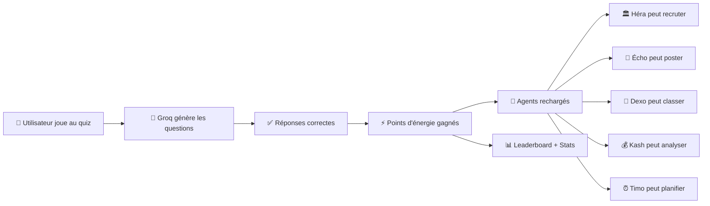

# 🎮 Quiz Game — Comment ça marche

## Le concept

L'utilisateur joue à un **quiz QCM** dont les questions sont **générées dynamiquement par l'IA** (Groq LLM). En répondant correctement, il gagne des **points d'énergie** qui rechargent les agents (Héra, Écho, Dexo, Kash, Timo).

> [!IMPORTANT]
> C'est de la **gamification** : les agents consomment de l'énergie quand ils travaillent. Le jeu permet de **recharger leur batterie** tout en s'amusant.

## Comment c'est relié au système



## Flux complet (6 endpoints API)

### Étape 1 : Voir les catégories

```
GET /api/game/categories
```

**Réponse :**
```json
{
  "categories": [
    { "id": "tech",      "name": "Tech",      "icon": "💻", "description": "Technologie, développement..." },
    { "id": "finance",   "name": "Finance",   "icon": "💰", "description": "Finance d'entreprise..." },
    { "id": "rh",        "name": "Rh",        "icon": "👥", "description": "Ressources humaines..." },
    { "id": "marketing", "name": "Marketing", "icon": "📢", "description": "Marketing digital..." },
    { "id": "ia",        "name": "Ia",        "icon": "🤖", "description": "Intelligence artificielle..." },
    { "id": "general",   "name": "General",   "icon": "📚", "description": "Culture générale..." },
    { "id": "challenge", "name": "Challenge", "icon": "🎯", "description": "Questions difficiles..." }
  ],
  "difficulties": [
    { "id": "easy",   "label": "Facile",    "emoji": "🟢", "timeLimit": 120 },
    { "id": "medium", "label": "Moyen",     "emoji": "🟡", "timeLimit": 90 },
    { "id": "hard",   "label": "Difficile", "emoji": "🔴", "timeLimit": 60 }
  ]
}
```

---

### Étape 2 : Lancer une partie

```
POST /api/game/quiz/start
Body: { "category": "ia", "difficulty": "medium", "numQuestions": 5 }
```

**Réponse :**
```json
{
  "game": {
    "token": "eyJhbnN3ZXJzIj...",
    "category": "ia",
    "difficulty": "medium",
    "timeLimit": 90,
    "rewards": { "perCorrect": 2, "perfectBonus": 5, "streakBonus": 2 },
    "questions": [
      {
        "id": 0,
        "question": "Qu'est-ce qu'un LLM en intelligence artificielle ?",
        "options": [
          "Un langage de programmation",
          "Un modèle de langage de grande taille",
          "Un réseau neuronal léger",
          "Un protocole de communication"
        ],
        "hint": "Pensez à GPT, LLaMA..."
      }
    ]
  }
}
```

> [!NOTE]
> Le `token` contient les bonnes réponses encodées. Le client ne voit **jamais** les réponses correctes avant de soumettre.

---

### Étape 3 : Soumettre les réponses

```
POST /api/game/quiz/submit
Headers: x-auth-token: <JWT>  (optionnel)
Body: {
  "token": "eyJhbnN3ZXJzIj...",
  "answers": [1, 0, 2, 3, 1],
  "timeTaken": 45,
  "targetAgent": "echo"
}
```

**`targetAgent`** : l'agent qui reçoit l'énergie (`echo`, `hera`, `dexo`, `kash`, `timo`, ou `null` pour distribuer à tous)

**Réponse :**
```json
{
  "result": {
    "score": 12,
    "correctAnswers": 4,
    "totalQuestions": 5,
    "percentage": 80,
    "bestStreak": 3,
    "isPerfect": false,
    "isSpeedRun": true,
    "energyEarned": 12,
    "energyDistribution": {
      "distributed": true,
      "amount": 12,
      "target": "echo"
    },
    "message": "🔥 Excellent ! Tu maîtrises ce sujet comme un pro !",
    "badge": {
      "name": "Speed Demon",
      "emoji": "🏎️",
      "description": "Rapide et efficace !"
    },
    "questionResults": [
      { "questionIndex": 0, "userAnswer": 1, "correctAnswer": 1, "isCorrect": true, "pointsEarned": 2 }
    ]
  }
}
```

---

### Étape 4 : Consulter le classement

```
GET /api/game/leaderboard?period=week&limit=10
```

**Réponse :**
```json
{
  "leaderboard": [
    {
      "rank": 1,
      "playerName": "Ahmed",
      "totalScore": 87,
      "gamesPlayed": 12,
      "accuracy": 85.5,
      "totalEnergy": 87,
      "bestStreak": 7
    }
  ]
}
```

---

### Étape 5 : Mes statistiques perso

```
GET /api/game/my-stats
Headers: x-auth-token: <JWT>
```

**Réponse avec système de niveaux :**
```json
{
  "stats": {
    "totalGames": 15,
    "totalScore": 120,
    "accuracy": 78,
    "rank": 3,
    "level": {
      "name": "Connaisseur",
      "emoji": "🎯",
      "progress": 20,
      "nextLevelName": "Expert",
      "nextLevelAt": 200
    }
  },
  "byCategory": [
    { "category": "ia", "games": 5, "accuracy": 90, "bestScore": 15 }
  ],
  "recentGames": [...]
}
```

---

### Étape 6 : Challenge quotidien

```
GET /api/game/daily-challenge
```

Un quiz **hard** de 7 questions, **le même pour tous les joueurs** chaque jour. Bonus de +5 énergie supplémentaire !

---

## Système de récompenses

| Difficulté | Par bonne réponse | Bonus parfait | Bonus streak (3+) |
|-----------|-------------------|---------------|-------------------|
| 🟢 Facile | +1 ⚡ | +3 ⚡ | +1 ⚡ |
| 🟡 Moyen | +2 ⚡ | +5 ⚡ | +2 ⚡ |
| 🔴 Difficile | +3 ⚡ | +10 ⚡ | +3 ⚡ |

**Bonus rapidité** : +2 ⚡ si tu réponds en moins de 50% du temps avec 60%+ de bonnes réponses.

## Système de niveaux

| Niveau | Score requis | Emoji |
|--------|-------------|-------|
| Débutant | 0 | 🌱 |
| Apprenti | 20 | 📘 |
| Explorateur | 50 | 🧭 |
| Connaisseur | 100 | 🎯 |
| Expert | 200 | ⭐ |
| Maître | 400 | 👑 |
| Légende | 700 | 🏆 |
| Mythique | 1000 | 🔥 |

## Fichiers créés

| Fichier | Rôle |
|---------|------|
| [QuizScore.js](file:///c:/Users/ghofr/OneDrive/Desktop/Projet_Integration_Mobile_BackEnd-fejjari/models/QuizScore.js) | Modèle MongoDB pour sauvegarder les scores |
| [gameController.js](file:///c:/Users/ghofr/OneDrive/Desktop/Projet_Integration_Mobile_BackEnd-fejjari/controllers/gameController.js) | Logique complète du jeu (génération IA, scoring, énergie) |
| [gameRoutes.js](file:///c:/Users/ghofr/OneDrive/Desktop/Projet_Integration_Mobile_BackEnd-fejjari/routes/gameRoutes.js) | 6 endpoints API |
| [app.js](file:///c:/Users/ghofr/OneDrive/Desktop/Projet_Integration_Mobile_BackEnd-fejjari/app.js) | Modifié — routes montées sur `/api/game` |
